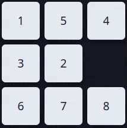

# N-Puzzle Explorer: Algoritmos de Busca em C++


<p align="center">
  
  
  
  
  
  
</p>


<p align="center">
  
</p>


----

## 🎯 Visão Geral do Projeto

Este projeto é uma implementação abrangente desenvolvida para a disciplina de Inteligência Artificial (DCC014) da Universidade Federal de Juiz de Fora (UFJF). O objetivo principal é apresentar e avaliar uma suíte de algoritmos de busca para a solução do clássico problema N-Puzzle. A solução foi projetada com um núcleo em **C++** para alta performance e um **servidor web** (usando o micro-framework Crow) que expõe a lógica para uma **interface gráfica web interativa** (HTML, CSS, JS). Além da interface web, uma versão para **linha de comando (CLI)** também está disponível.

O trabalho foca na comparação sistemática do desempenho dos algoritmos com base em métricas de eficiência e qualidade da solução, como custo do caminho, nós expandidos e tempo de execução.

## 🚀 Algoritmos Implementados

O projeto implementa sete algoritmos de busca distintos, divididos em duas categorias principais.

### 1. Busca Não Informada (Cega)
Algoritmos que exploram o espaço de estados sem qualquer conhecimento sobre a distância até o objetivo.

* **Backtracking:** Utiliza uma abordagem de profundidade (DFS) de forma recursiva, retrocedendo quando um caminho se mostra inviável. A versão implementada é limitada em profundidade para evitar loops e caminhos infinitos.
* **Busca em Largura (BFS - Breadth-First Search):** Explora a árvore de busca nível a nível, garantindo a solução com o menor número de movimentos (ótima para custos de ação unitários).
* **Busca em Profundidade (DFS - Depth-First Search):** Explora um ramo da árvore até sua profundidade máxima antes de retroceder. A versão implementada é limitada em profundidade para evitar loops e caminhos infinitos.
* **Busca Ordenada (Uniform Cost Search):** Expande o nó com o menor custo acumulado (`g(s)`) desde a origem. Garante a solução de menor custo total.

### 2. Busca Informada (Heurística)
Algoritmos que utilizam uma função heurística, `h(s)`, para estimar o custo até o estado final, guiando a busca de forma mais eficiente.

* **Busca Gulosa (Greedy Search):** Expande o nó que a heurística aponta como o mais próximo do objetivo (`h(s)`), ignorando o custo já percorrido.
* **Busca A\* (A-Star):** Combina o custo real para chegar a um nó (`g(s)`) com a estimativa heurística para chegar ao objetivo (`h(s)`), através da função `f(s) = g(s) + h(s)`. Garante a solução ótima se a heurística for admissível.
* **Busca IDA\* (Iterative Deepening A\*):** Uma variante do A* que consome menos memória. Realiza buscas em profundidade sucessivas com um patamar de custo (`f(s)`) crescente, combinando a eficiência de memória do DFS com a otimalidade do A*.

## 🧠 Funções Heurísticas

Seis funções heurísticas foram implementadas para guiar os algoritmos de busca informada.

1.  **Peças Fora do Lugar (Misplaced Tiles):** Simplesmente conta o número de peças que não estão em sua posição de destino.
2.  **Distância de Manhattan:** Calcula a soma das distâncias horizontais e verticais de cada peça de sua posição atual até sua posição objetivo.
3.  **Distância Euclidiana:** Similar à de Manhattan, mas calcula a distância em linha reta (a hipotenusa) entre a posição atual e a objetivo.
4.  **Conflito Linear (Linear Conflict):** Um refinamento da Distância de Manhattan que adiciona uma penalidade para cada par de peças que estão na mesma linha ou coluna de seus objetivos, mas em posições invertidas.
5.  **Ciclos de Permutação (Permutation Cycles):** Analisa a permutação das peças como um conjunto de ciclos e soma o número de peças fora do lugar com o número de ciclos.
6.  **Soma Ponderada (Weighted Sum):** Combina múltiplas heurísticas (neste trabalho, Distância de Manhattan e Peças Fora do Lugar) através de uma soma ponderada para obter uma estimativa mais precisa.

## 📊 Estatísticas Coletadas

Para cada execução, o programa coleta e exibe as seguintes métricas de desempenho, conforme os requisitos do trabalho:

* **Caminho, profundidade e custo da solução**.
* **Número total de nós expandidos e visitados**.
* **Valor médio do fator de ramificação da árvore de busca**.
* **Tempo de execução**.

## 🏗️ Arquitetura e Tecnologias

* **Linguagem Principal:** `C++` (padrão C++17) foi escolhido pela alta performance e controle de baixo nível sobre a memória, essenciais para a complexidade do problema.
* **Backend:**
    * **Servidor Web:** Utiliza o micro-framework **Crow** para criar um servidor HTTP e expor os algoritmos como uma API para o frontend.
    * **Estruturas de Dados:**
        * **Vetor:** O tabuleiro é representado como um vetor para facilitar certas operações heurísticas.
        * **Hash:** Utilizado para transformar o estado do tabuleiro em um número único, permitindo comparações de estado em tempo O(1).
        * **Recursão:** Usada na implementação do Backtracking e IDA* para maior legibilidade do código.
* **Frontend:**
    * Desenvolvido com tecnologias web padrão: **HTML, CSS e JavaScript**.
    * A interface guia o usuário na configuração do problema (tabuleiros de 2x2 a 5x5), seleção do algoritmo/heurística, execução e visualização animada da solução.
* **Comunicação:** A interação entre Frontend (JS) e Backend (C++/Crow) é feita via **API HTTP** com um modelo de requisição/resposta.

## 📁 Organização do Projeto

O repositório está estruturado para separar claramente as responsabilidades, como a lógica do backend, a interface do frontend, os arquivos de cabeçalho, os dados de teste e os executáveis.

<details open>
<summary>📂 <strong>Estrutura Completa do N-Puzzle (Clique para expandir/recolher)</strong></summary>
<ul>
    <li>
        <details>
            <summary>📂 <strong>assets/</strong> - Recursos visuais para a documentação.</summary>
            <ul>
                <li>📄 <code>demo.gif</code> - GIF de demonstração da interface web interativa.</li>
            </ul>
        </details>
    </li>
    <li>
        <details>
            <summary>📂 <strong>backend/</strong> - Lógica principal em C++ (o "coração" da aplicação).</summary>
            <ul>
                <li>
                    <details>
                        <summary>📂 <strong>api/</strong> - Handlers que definem os endpoints da API REST.</summary>
                        <ul>
                            <li>📄 <code>server_app.cpp</code> - Implementação da lógica do servidor e rotas da API.</li>
                        </ul>
                    </details>
                </li>
                <li>
                    <details>
                        <summary>📂 <strong>Crow/</strong> - Cópia do micro-framework web Crow.</summary>
                        <ul>
                            <li>📂 <strong>include/</strong> - Arquivos de cabeçalho do micro-framework Crow.</li>
                            <li>📂 <strong>thirdparty/</strong> - Dependências de terceiros do Crow.</li>
                        </ul>
                    </details>
                </li>
                <li>
                    <details>
                        <summary>📂 <strong>heuristics/</strong> - Implementação das funções heurísticas.</summary>
                        <ul>
                            <li>📄 <code>heuristics.cpp</code> - Código-fonte com a implementação das 6 funções heurísticas.</li>
                        </ul>
                    </details>
                </li>
                <li>
                    <details>
                        <summary>📂 <strong>npuzzle/</strong> - Representação do tabuleiro e estruturas de dados.</summary>
                        <ul>
                            <li>📄 <code>board.cpp</code> - Classe que representa o estado do tabuleiro e suas operações.</li>
                            <li>📄 <code>board_utils.cpp</code> - Funções utilitárias para manipulação do tabuleiro.</li>
                            <li>📄 <code>list.cpp</code> - Estruturas de dados para as listas Aberta e Fechada.</li>
                        </ul>
                    </details>
                </li>
                <li>
                    <details>
                        <summary>📂 <strong>solver/</strong> - Implementação dos 7 algoritmos de busca.</summary>
                        <ul>
                            <li>📄 <code>a_star.cpp</code> - Implementação do algoritmo A*.</li>
                            <li>📄 <code>backtracking.cpp</code> - Implementação do algoritmo Backtracking.</li>
                            <li>📄 <code>bfs.cpp</code> - Implementação da Busca em Largura (BFS).</li>
                            <li>📄 <code>dfs.cpp</code> - Implementação da Busca em Profundidade (DFS).</li>
                            <li>📄 <code>greedy.cpp</code> - Implementação da Busca Gulosa (Greedy).</li>
                            <li>📄 <code>ida_star.cpp</code> - Implementação do algoritmo IDA*.</li>
                            <li>📄 <code>order.cpp</code> - Implementação da Busca Ordenada (Custo Uniforme).</li>
                        </ul>
                    </details>
                </li>
                <li>
                    <details>
                        <summary>📂 <strong>utils/</strong> - Funções utilitárias para o backend.</summary>
                        <ul>
                            <li>📄 <code>router.cpp</code> - Lógica de roteamento e validação de requisições da API.</li>
                            <li>📄 <code>statistics.cpp</code> - Coleta e formatação das estatísticas de execução.</li>
                        </ul>
                    </details>
                </li>
            </ul>
        </details>
    </li>
    <li>
        <details>
            <summary>📂 <strong>data/</strong> - Instâncias de teste para o N-Puzzle.</summary>
            <ul>
                <li>📄 <code>test3x3_1.txt</code>, <code>test4x4_1.txt</code>, etc. - Arquivos com as configurações iniciais dos tabuleiros.</li>
            </ul>
        </details>
    </li>
    <li>
        <details>
            <summary>📂 <strong>docs/</strong> - Documentação do projeto.</summary>
            <ul>
                <li>📄 <code>DCC014-TrabalhoPratico.pdf</code> - Enunciado original do trabalho prático.</li>
                <li>📄 <code>Relatorio-Final.pdf</code> - Relatório final com análises e conclusões.</li>
                <li>📄 <code>Slide.pdf</code> - Slides utilizados na apresentação do projeto.</li>
            </ul>
        </details>
    </li>
    <li>
        <details>
            <summary>📂 <strong>frontend/</strong> - Interface web interativa (HTML, CSS, JS).</summary>
            <ul>
                <li>📄 <code>index.html</code> - Estrutura principal da página (HTML5).</li>
                <li>
                    <details>
                        <summary>📂 <strong>css/</strong> - Folhas de estilo.</summary>
                        <ul>
                            <li>📄 <code>style.css</code> - Folha de estilo principal da aplicação (CSS3).</li>
                        </ul>
                    </details>
                </li>
                <li>
                    <details>
                        <summary>📂 <strong>js/</strong> - Lógica do lado do cliente.</summary>
                        <ul>
                            <li>📄 <code>animation.js</code> - Controla a animação da solução no tabuleiro.</li>
                            <li>📄 <code>fetcher.js</code> - Realiza as requisições (fetch) para a API do backend.</li>
                            <li>📄 <code>ui.js</code> - Manipulação dos elementos da interface do usuário.</li>
                        </ul>
                    </details>
                </li>
            </ul>
        </details>
    </li>
    <li>
        <details>
            <summary>📂 <strong>include/</strong> - Arquivos de cabeçalho (<code>.hpp</code>) para todo o projeto C++.</summary>
            <ul>
                <li>📄 <code>a_star.hpp</code>, <code>backtracking.hpp</code>, etc. - Declarações de classes e funções para cada componente do projeto.</li>
            </ul>
        </details>
    </li>
    <li>
        <details>
            <summary>📂 <strong>results/</strong> - Gráficos e imagens para a análise de desempenho.</summary>
            <ul>
                <li>📄 <code>grafico_astar.png</code> - Gráfico comparativo de heurísticas para o A*.</li>
                <li>📄 <code>grafico_greedy.png</code> - Gráfico comparativo de heurísticas para o Greedy.</li>
                <li>📄 <code>grafico_idastar.png</code> - Gráfico comparativo de heurísticas para o IDA*.</li>
                <li>📄 <code>grafico1_nao_informados.png</code> - Comparativo de tempo para algoritmos não informados.</li>
                <li>📄 <code>grafico2_nao_informados.png</code> - Comparativo de nós expandidos para não informados.</li>
            </ul>
        </details>
    </li>
    <li>
        <details>
            <summary>📂 <strong>scripts/</strong> - Scripts de automação e análise.</summary>
            <ul>
                <li>📄 <code>exec_all.sh</code> - Script de automação para executar todos os testes em lote.</li>
                <li>📄 <code>search_algorithms_performance.py</code> - Script Python para gerar os gráficos de análise.</li>
            </ul>
        </details>
    </li>
    <li>
        <details>
            <summary>📂 <strong>src/</strong> - Arquivos-fonte principais (pontos de entrada).</summary>
            <ul>
                <li>📄 <code>cli_app.cpp</code> - Implementação da interface de linha de comando (CLI).</li>
                <li>📄 <code>main.cpp</code> - Ponto de entrada que decide entre CLI e Servidor Web.</li>
            </ul>
        </details>
    </li>
    <li>📖 <strong>README.md</strong> - Este arquivo de documentação.</li>
    <li>⚙️ <strong>Makefile</strong> - Gerencia a compilação e a criação dos executáveis.</li>
    <li>🚀 <strong>npuzzle_exec</strong> - Executável da versão Terminal (CLI).</li>
    <li>🚀 <strong>npuzzle_server</strong> - Executável da versão Servidor Web.</li>
</ul>
</details>

## ⚙️ Compilação e Execução

### Pré-requisitos
* **Linux:** Compilador `g++` e utilitário `make`.
* **Windows:** Ambiente com ferramentas GNU, como **MinGW-w64** (usado via terminal MSYS2).

### Passos para Execução
1.  **Compilar o projeto:**
    O `Makefile` gerencia todo o processo de compilação para ambos os executáveis (`npuzzle_exec` e `npuzzle_server`).

    ```sh
    make
    ```

2.  **Executar a Aplicação:**
    * **Versão Terminal (CLI):**
        Execute o comando abaixo. O programa é interativo e solicitará a configuração do problema.

        ```sh
        ./npuzzle_exec 
        ```

    * **Versão Servidor Web:**
        Inicie o servidor com o comando a seguir.

        ```sh
        ./npuzzle_server
        ```
        Após iniciar o servidor, acesse a interface gráfica no seu navegador:
        **[http://localhost:18080/](http://localhost:18080/)** 

### Testes Automatizados
O projeto inclui um script [`exec_all.sh`](./scripts/exec_all.sh) para executar uma bateria de testes.
* Ele itera sobre todos os arquivos de instância no diretório [`data/`](./data/).
* Para cada instância, executa todos os 7 algoritmos.
* Para os algoritmos informados, testa todas as 6 heurísticas.
* As saídas são salvas em arquivos de texto no diretório [`output/`](./output/) para análise posterior.

## 📈 Principais Conclusões

Com base nos testes e análises, algumas conclusões importantes foram extraídas:

* **Eficiência do A\* e IDA\*** : Os algoritmos A* e IDA*, quando combinados com uma heurística admissível como a Distância de Manhattan, provaram ser os mais eficientes para encontrar a **solução ótima** em um tempo razoável.
* **Desempenho da Busca Ordenada**: Em cenários de custo unitário, a Busca Ordenada se comportou de forma similar à Busca em Largura, mas com uma sobrecarga computacional maior, tornando-a menos performática.
* **Heurísticas Não Admissíveis**: Embora não ofereçam garantias, heurísticas não admissíveis como a Distância Euclidiana foram capazes de encontrar a solução ótima em alguns casos específicos, mas não são confiáveis para garantir otimalidade.

## 🔮 Trabalhos Futuros

Para aprimorar ainda mais o projeto, as seguintes melhorias são sugeridas:

* **Otimização de Estrutura de Dados:** Substituir a lista de nós abertos por uma **Min-Heap** para otimizar a seleção do próximo nó nos algoritmos A* e Busca Ordenada, reduzindo a complexidade de `O(n)` para `O(log n)`.
* **Verificador de Ancestralidade:** Implementar um mecanismo para impedir que um nó gere seu "pai" como sucessor, podando ramos redundantes da árvore de busca.
* **Exploração de Novas Heurísticas:** Pesquisar e implementar heurísticas mais sofisticadas, como **Pattern Databases (PDBs)**, para resolver tabuleiros de maior complexidade.


## 👥 Integrantes do Grupo

* **Breno Montanha Costa** ([@Breno Montanha](https://github.com/BrenoMontanha))
* **Lucas Henrique Nogueira** ([@Lucas Henrique](https://github.com/Lucas-Henriquee))

### Divisão de Tarefas
* **Lucas:** Arquitetura do sistema, desenvolvimento do Backend (C++), Frontend (Web), implementação dos algoritmos Backtracking, DFS e A*, e das heurísticas Manhattan, Conflito Linear e Soma Ponderada.
* **Breno:** Implementação dos algoritmos BFS, Ordenada, IDA* e Gulosa, das heurísticas Misplaced Tiles, Ciclos de Permutação e Euclidiana, criação da CLI e análise dos resultados.


## 📚 Inteligência Artificial
**Disciplina:** Inteligência Artificial (DCC014) - UFJF  
**Período:** 2025/1